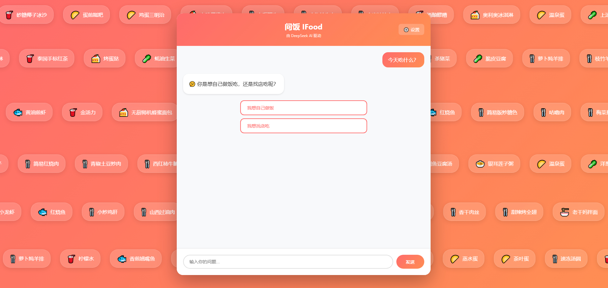
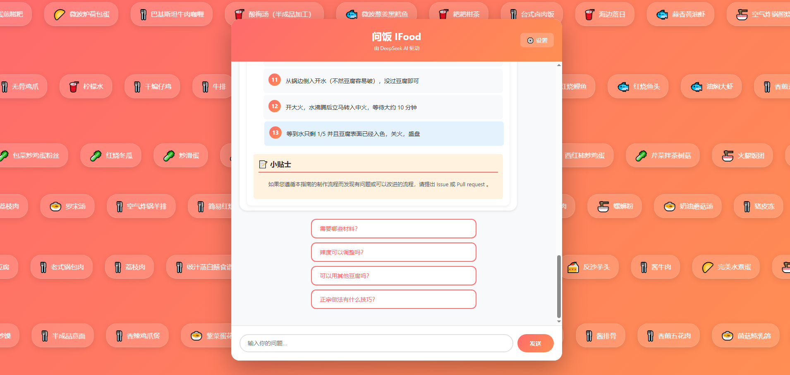
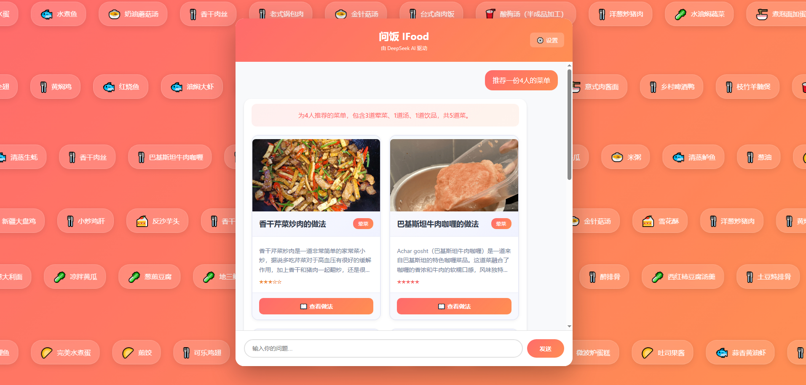
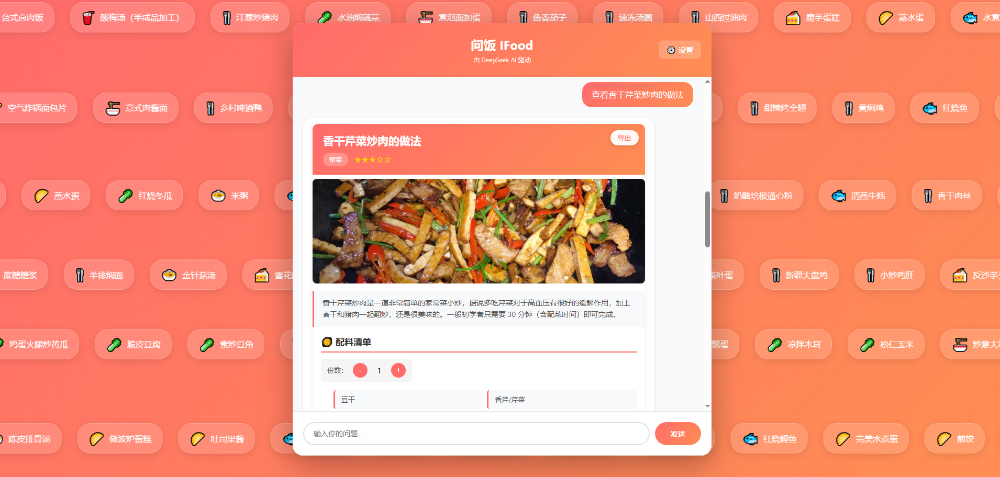
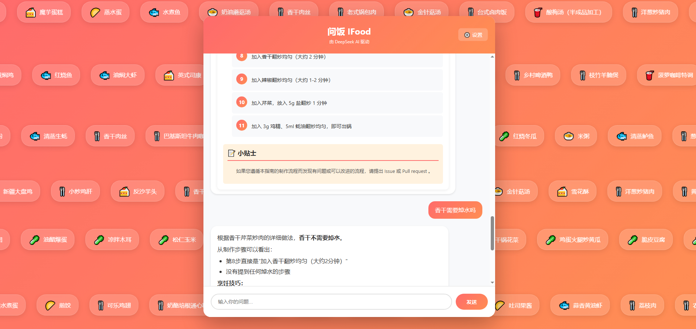
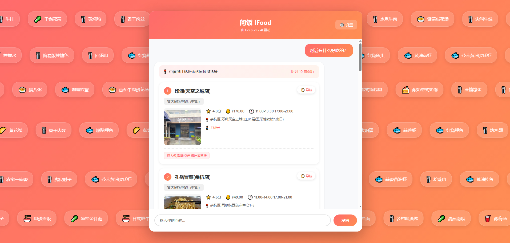
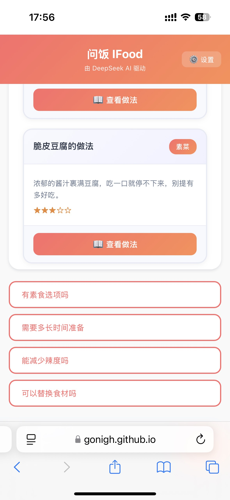
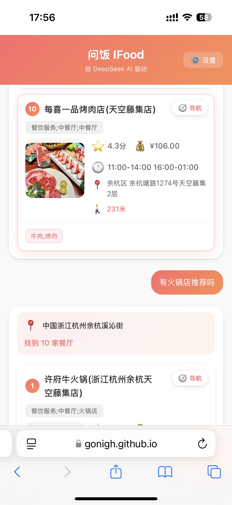

# 🍜 问饭 - AI 美食助手

基于 DeepSeek AI 的智能美食应用，解决"今天吃什么"的难题。

**在线体验**：https://gonigh.github.io/wenfan-ifood/

## ✨ 核心功能

### 🍳 自己做饭
- **智能菜单推荐** - 根据人数推荐完整菜单，自动荤素搭配
- **菜谱查询** - 内置 3000+ 道菜谱，包含详细食材和步骤
- **联网搜索** - 本地没有的菜品自动联网搜索最新做法
- **自定义菜谱** - 通过对话添加自己的独家配方

### 🏪 找店吃饭
- **附近餐厅搜索** - 自动定位，搜索周边美食
- **详细信息** - 评分、人均消费、营业时间、推荐菜
- **一键导航** - 直接跳转高德地图导航

### 🤖 智能交互
- **意图识别** - 自动判断你是想做饭还是找店
- **自然对话** - 支持自然语言交互
- **智能推荐** - 根据对话内容推荐后续问题
- **多端适配** - 手机和 PC 都能完美使用

## 🚀 快速开始

**本地使用**：直接双击打开 `index.html` 即可使用，无需安装任何依赖

1. 打开应用，已预置体验 API Key，可直接使用
2. 输入问题：
   - **做饭类**："推荐一份 4 人的菜单" / "麻婆豆腐怎么做？"
   - **找店类**："附近有什么好吃的？" / "推荐一家火锅店"
   - **模糊意图**："今天吃什么？"（会提示选择做饭或找店）
3. 查看结果：
   - 菜谱：点击卡片查看详细做法
   - 餐厅：查看评分、人均、距离，一键导航

**替换 API Key**：点击右上角⚙️设置，在 [DeepSeek 官网](https://platform.deepseek.com/api_keys) 申请免费 Key

##  功能预览

1. 意图识别：在家在外都能问





2. 菜单生成：一键生成推荐菜



3. 做法详情：配料、做法都搞定



4. 上下文连贯：有疑问随时提



5. 附件美食：火锅？烤肉？饭菜？都能搜



6. 移动端也支持




## 📁 项目结构

```
wenfan/
├── index.html              # 主页面
└── src/
    ├── app.js              # 应用入口
    ├── style.css           # 样式文件
    ├── agent/              # Agent 代理模块
    │   ├── agentDispatcher.js     # 调度器（意图识别）
    │   ├── baseAgent.js           # 基础 Agent 类
    │   ├── cookAgent.js           # 做饭 Agent
    │   ├── foodFinderAgent.js     # 找店 Agent
    │   └── suggestionAgent.js     # 推荐问句 Agent
    ├── tools/              # AI 工具函数
    │   ├── index.js               # 菜谱工具（推荐/查询/添加）
    │   └── amapTools.js           # 高德地图工具（定位/搜索）
    ├── components/         # UI 组件
    │   ├── menu-card.js           # 菜单卡片
    │   ├── recipe-detail.js       # 菜谱详情
    │   ├── restaurant-list.js     # 餐厅列表
    │   └── background.js          # 滚动背景
    └── data/
        └── recipes-data.js        # 菜谱数据（3000+）
```

## 🛠️ 技术栈

- **前端**：原生 HTML5 + CSS3 + JavaScript (ES6+)
- **AI**：DeepSeek Chat (Function Calling + Web Search + 意图识别)
- **地图**：高德地图 API（定位 + POI 搜索）
- **定位**：ipinfo.io + ip77.net（IP 定位）
- **其他**：Marked.js (Markdown 渲染)、html2canvas (截图)


## 🙏 致谢

- 菜谱数据：[HowToCook](https://github.com/Anduin2017/HowToCook)
- AI 模型：[DeepSeek](https://www.deepseek.com/)
- 高德地图: [高德API](https://lbs.amap.com/api/webservice/guide/api-advanced/newpoisearch)

